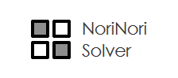
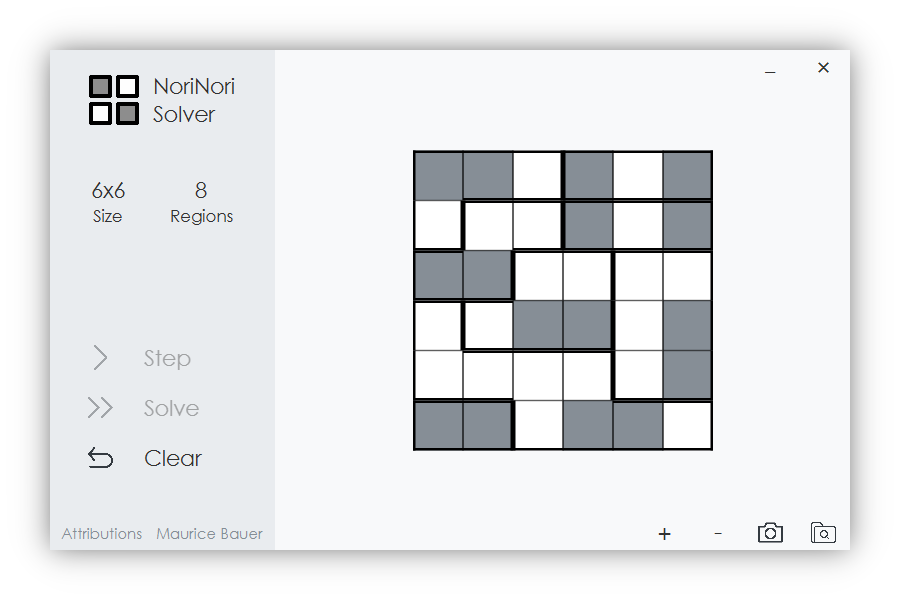

---

The **NoriNori Solver** is a **Java 11** application capable of solving NoriNori puzzles stored in **JSON** files through the help of backtracking. **JavaFX** is used to create the following GUI:



## Getting started

This project uses **Gradle** for dependency and build management. With its help it is quite easy to get the NoriNorI Solver running on your machine:

```
> gradlew.bat run   // Windows
> ./gradlew run     // MacOS and Linux
```

## Usage

After starting the application using `gradlew`, you can drag and drop a JSON file onto the application. After loading the file a simple click on "Solve" lets the solver solve the board and updates the result in the GUI. After finishing calcuation you can store the result as a `.png`-file using the screenshot button at the bottom-right.

The following keyboard shortcuts can also be used to speed up the usage of this application:

- `F1` - Show the attributions-window
- `F2` - Open a JSON file using a file chooser
- `F5` - Perform a solver step
- `F6` - Solve the whole NoriNori puzzle
- `F7` - Clear the current board
- `F8` - Close the application

## Data format

As mentioned at the beginning, all NoriNori boards are saved in JSON files. Such a JSON file is in the following format, where the arrays represent the board and the numbers the region identifiers (to have a way to express the borders / regions).

The following JSON file shows the source code for the NoriNori puzzle shown in the GUI screenshot at the top:

```javascript
// Content of examples/6x6.json
[
  [0,0,0,1,1,1],
  [0,2,2,3,3,3],
  [2,2,4,4,5,5],
  [6,4,4,4,5,5],
  [6,6,6,6,5,5],
  [7,7,6,6,6,6]
]
```